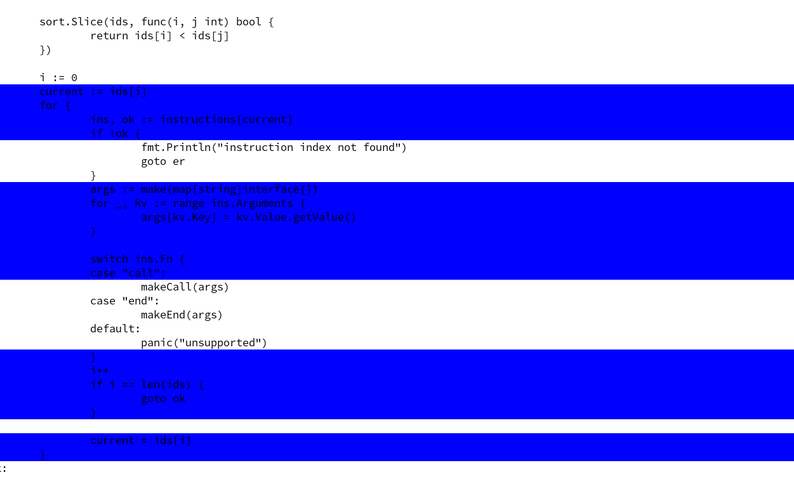

# Highlight coverage in code.

*IN PROGRESS*

#### run-test and highlight code
```
M-x cover-highlight
```
You should have go in the standard path or change it in the file.



#### remove all highlights

```
M-x cover-highlight-stop
```
